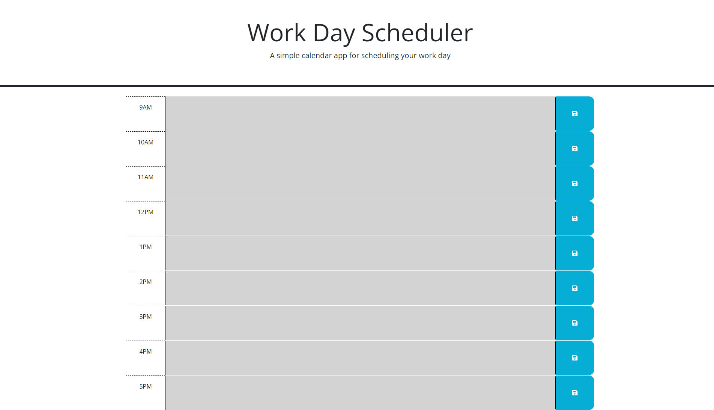

# Work-Day-Scheduler
This is an application for the busy proffessional to be able to keep track of their day. I have linked the Day.js library to the application to be able to dynamically style the webpage depending on the users current time of day. The notes that the user puts in and saves will populate local storage so it can persist through reloads.

## Screenshot

###Deployement 
https://mhengerer.github.io/Work-Day-Scheduler/